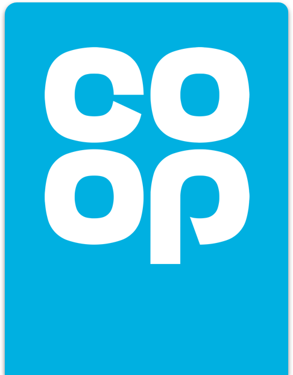

# Coop Design System - React UI Library

## Tech stack
Building components
- 📚 [Storybook](https://storybook.js.org) for UI component development and [addon docs](https://medium.com/storybookjs/storybook-docs-sneak-peak-5be78445094a).
- 🎨 [Sass](https://sass-lang.com/) for component styling.
- ⚛️ [React](https://reactjs.org/) declarative component-centric UI.
- 👨‍🔬[Jest](https://jestjs.io/) and [react-testing-library](https://testing-library.com/) as testing frameworks.

System maintenance
- 🗃️[Rollup](https://rollupjs.org/) for bundling code into our React library.
- 📦[Yarn](https://classic.yarnpkg.com/) for package dependency management.

Other
- Jest support
- Typescript support
- Webpack/Babel
- eslint/prettier

### Why 
This library codifies existing [Coop web components](https://coop-design-system.herokuapp.com/) into React components. It is built to address having to paste the same components into multiple projects again and again. This simplifies and speeds up building React apps throughout the Coop ecosystem.

### What
- Build and maintain the Coop React UI components
- Share those components between multiple apps
